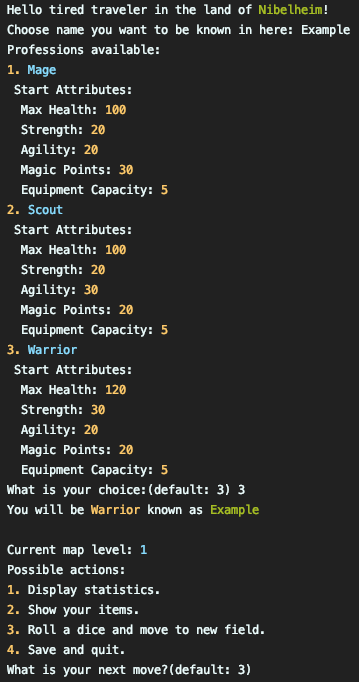
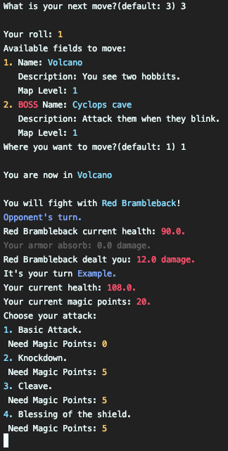
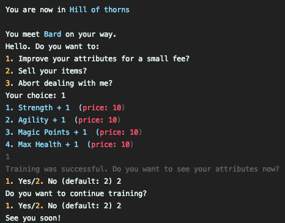

# Tales from Nibelheim
[](https://www.codacy.com?utm_source=github.com&amp;utm_medium=referral&amp;utm_content=TalesFromNibelheim/TalesFromNibelheim&amp;utm_campaign=Badge_Grade)<br>
**Team:** Konrad Gabrukiewicz, Jędrzej Racibor, Kamil Suchy

### Description
**Tales from Nibelheim** is console RPG game inspired board games such as Talisman. It was made as part of Software Engineering course at WMII UJ in year 2019/2020. 

### Gameplay
Player choose his next move by typing number assigned to each avalible action. The board is made up of 3 levels and each one is randomized from predefined pool of available fields. Goal of the game is to reach and defeat boss at level 3.

 1. Before exploration of game world player picks one of three available
    characters and nickname.
 2. Game starts at level 1 of the board to unlock way to next level player has to defeat the boss.
 3. Player gain gold for winnig fight with enemy that can be spend for improvement of his attributes.
 4. Meeting coach is only way to improve attributes and price of it increase with each additional point.
 5. When player moves to next field there is a random chance of getting item or friend.
 6. Player has limited backpack capacity and he needs to sell for coach items that are not for his character or to make space for new one.

 ### Libraries used in project
 - Java 11
    - Jackson with YAML extension
    - Lombok
    - JUnit

## Customization
One of the main assumptions of the project were its ability to be customized. That is why cards and fields are read from yaml file. Game comes with few predefined but feel free to make your own.

### Config
```
level1Size: 10 #Number of fields at 1 level  
level2Size: 7 #Number of fields at 2 level  
level3Size: 5 #Number of fields at 3 level  
maxMove: 3 #Maximum player movement
landName: Nibelheim #Name of game world
```

### Field
**Normal field:**
```
- type: "normal" #field type  
  mapLevel: 1 #on which map level field appear
  name: "Flowery clearing" 
  description: "You fell like in fairy land." 
  actions: #actions possible to draw on field  
	- type: "card" #take card  
	- type: "fight" #fight with enemy
	  entity:  
		  name: "Wolf"  
		  health: 60  
	      baseStrength: 5  
      reward: 10 #gold for defeating enemy
	- type: "coach"
	  name: "Bard"  
	  price: 10.0 #base price of atribute
      multiplier: 1.0 #how fast price rise
```
**Boss field:**
```
- type: "boss"  
  mapLevel: 1  
  name: "Dragon's cave"  
  description: "It's pretty warm here."  
  actions:  
	- type: "card"  
	- type: "fight"  
	  entity:  
		name: "Red Brambleback"  
		health: 30  
        baseStrength: 10  
      reward: 20  
	- type: "coach"  
	  name: "Bard"  
	  price: 10.0  
      multiplier: 1.0  
  boss:  
	name: "Lord of Dragons"  
	health: 1000  
    baseStrength: 45
    multiplier: 1.2 #skills multiplier
```

### Card
**Item:**
```
- type: "item" #card type 
  name: "Sample item"  
  carriable: true #true - card is added to player's equipment
  description: "Item example."  
  strength: 10   
  agility: 20
  magicPoints: 1
  health: 10
  armor: 10
  itemValue: 100 #sell price of item  
  profession: "pl.grsrpg.player.PlayerWarrior" #profession that can use item
  #pl.grsrpg.player.PlayerWarrior - for warrior
  #pl.grsrpg.player.PlayerMage - for mage
  #pl.grsrpg.player.PlayerScout - for scout
  #if not specified, item is for every profession
```
**Gold:**
```
- type: "item"  
  name: "Gold"  
  carriable: false  
  description: "500 gold"  
  gold: 500
```
**Enemy:**
```
- type: "enemy"  
  enemy:  
	name: "Wolf"  
	health: 40  
	baseStrength: 20  
  reward: 10 #gold for defeating enemy
```
**Friend:**
```
- type: "friend"  
  name: "Friend sample"  
  description: "Example friend."  
  multiplierGold: 2.0 #multiply received gold
  addPoint: true #additional point to dice roll
  capacity: 30 #additional equipment capacity
```

## Game aspects

 1. Ability to modify cards and fields via text files.
 2. Ability to save game and auto save after fight with enemy.
 3. Player can have only one friend.
 4. Player can check item he got only when it is received and in coach shop.
 5. To get to map level 3 player need to roll exactly number of fields he is from 1st field of 3rd map level. *Example: player is at boss field of 2nd map level he need to roll 1 to get to 3rd one.*
 6. At 3rd map level player can move only by one field.
 
## Screenshots
**Game start:**<br>
<br>
**Fight:**<br>
<br>
**Coach:**
<br>

